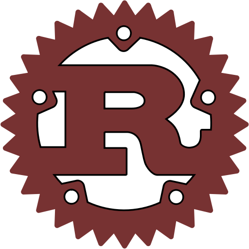

### Hi, I'm <a href="https://innvt.in" target="_blank">Jiran Kurian</a>  &nbsp; &nbsp; &nbsp; &nbsp; &nbsp; &nbsp; &nbsp; &nbsp; &nbsp;

  
  &nbsp;
  
  &nbsp;
  
  &nbsp;
  
  &nbsp;
  

### About me!
 * PhD Research Scholar @ [CHRIST (Deemed to be University), Bangalore](https://christuniversity.in/)
 * Currently researching on Artificial General Intelligence
 * Co - founder @ [Innvt](innvt.in)
 * [Resume](https://www.canva.com/design/DAEfZENMYiA/sK4RWGFSqpKWbBKCK7EmRA/view?utm_content=DAEfZENMYiA&utm_campaign=designshare&utm_medium=link&utm_source=homepage_design_menu)

  
  

  
&nbsp;&nbsp;&nbsp;
  
&nbsp;&nbsp;&nbsp;
  
&nbsp;&nbsp;&nbsp;
  
&nbsp;&nbsp;&nbsp;
  
&nbsp;&nbsp;&nbsp;
  

